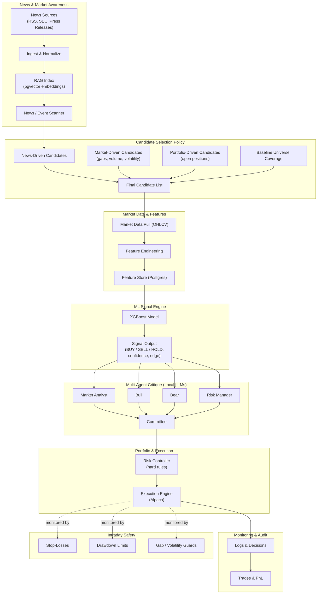

# News-First RAG + XGBoost + Multi-Agent Trading System  
(PostgreSQL · pgvector · Alpaca · Ollama · Docker)

---

## Overview

This repository implements a **fully automated, institutional-style trading system** built around a clear separation of responsibilities:

- **News & events decide where to look**
- **Machine learning decides what the signal is**
- **LLM agents critique and stress-test decisions**
- **Deterministic rules enforce capital and risk discipline**
- **Execution and monitoring are fully auditable**

The system is **news-first**, **ML-driven**, and **rule-controlled**, designed to scale from a local machine to a home server with minimal changes.

> **Design philosophy**  
> News routes attention.  
> ML proposes trades.  
> Agents challenge assumptions.  
> Rules enforce discipline.  
> Execution follows audited decisions.

---

## Key Design Decisions (Locked)

- **Trading cadence:** Daily  
- **Full decision runs:** Twice per trading day  
  - Morning (open-ish)
  - Afternoon (pre-close)
- **Intraday behavior:**  
  - No LLM agents  
  - Deterministic safety only (stops, drawdown, gap/volatility rules)
- **Universe:** Blue-chip equities (liquid large caps)
- **Automation:** Fully automated (no human-in-the-loop)
- **Deployment:** Docker + Docker Compose

---

## High-Level System Flow (News-First)

---
#### Tech Stack
Core
* Python – orchestration, features, ML, policy, execution

* PostgreSQL – system of record

* pgvector – vector search for news RAG

* XGBoost – primary ML signal engine

* Alpaca API – paper / live execution

Local AI

* Ollama – local LLM runtime

* News & sentiment summarization

* Analyst / Bull / Bear / Risk / Committee agents

Deployment

* Docker + Docker Compose

* reproducible runs

* easy migration to a home server

* clean separation of services

---
#### Dockerized Runtime Architecture

* postgres
  * OHLCV bars
  * features
  * news + embeddings (pgvector)
  * signals, agent reports, decisions, trades

* ollama
  * local LLMs for agents & sentiment

* app
  * Python trading orchestrator

* scheduler (optional)
  * triggers twice-daily runs

---
#### Candidate Selection Policy (Summary)

A ticker is analyzed if any of the following apply:
1. News-Driven
   * earnings, guidance, legal/regulatory, M&A, analyst actions
   * high novelty or sentiment magnitude

2. Market-Driven
    * large gaps
    * abnormal volume or volatility
    * breakouts / breakdowns

3. Portfolio-Driven (mandatory)
    * all open positions
    * positions near stops or exits

4. Baseline Coverage
    * rotating subset of blue-chip stocks to avoid blind spots
    * Candidate selection decides what gets analyzed, not what gets traded.

---
#### ML Signal Engine (LSTM or XGBoost)
* Evaluates candidate tickers only
* Outputs:
  * BUY / SELL / HOLD
  * confidence / expected return
  * edge score
* ML is the only component allowed to propose new trades
---
#### Multi-Agent Critique (Local LLMs)
Agents do not generate trades.
They:
* critique ML proposals
* evaluate news evidence
* identify risk and blind spots
Agents:
* Market Analyst (regime / anomaly)
* Bull (best-case thesis)
* Bear (counter-thesis)
* Risk Manager (event & exposure risk)
* Committee (final proposal)
Agents may reduce or veto trades — never increase exposure.
---
Portfolio & Risk Controller (Hard Rules)
Final authority (pure code):
* risk-per-trade sizing
* max position size per stock
* max portfolio exposure
* drawdown-based de-risking
* optional volatility targeting
LLMs cannot override this layer.
---
Position Lifecycle
Scheduled (Twice Daily)
* enter new positions
* reduce / exit existing positions
* update stops and targets
Intraday (Always On, No Agents)
* stop-loss execution
* drawdown enforcement

gap / volatility emergency rules
